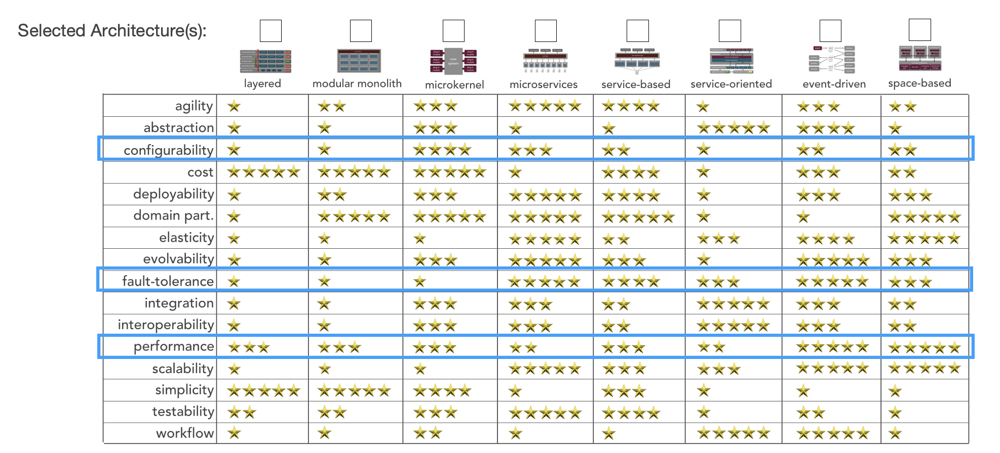

# Architecture characteristics and Architecture Style

## Default system characteristics

**Data consistency** as stated in the requirements, the data should be consistent and no transformation of data should not be considered as per the requirements. No change of data should happen in each hop of the data through different components of the system.

**Security** the patient related data need to be encrypted in transit.The data cannot be accessed without proper authentication/role.

## Top architecture characteristics considered

**Performance:** specific performance requirements, a driving characteristics as any delays in the system would be a risk for the patients

**Availability:** system uptime should be very high to ensure patient safety. Shared parts of the system may not be impacted from malfunction in one of the monitoring devices and there should not be critical runtime dependencies to any external system

**Fault tolerance:** as stated in the requirements, system should be fault tolerant at the individual sensor level. Cases like detached sensors should not impact the other functionalities

**Data integrity:** data loss should be at minimum and data sequence should be preserved, as any coherence issues could be interpreted as a medical issue on the patient

**Configurability:** the system will be delivered with configurations including varying numbers or monitoring devices and nurse stations. The initial configuration of the site should be easy into system once the physical set-up is complete.

**deployability:** the system need to be deployed easily without much complexity. Ease of deployment will help the installation in many sites in scale without hassles.

### Other characteristics considered

Responsiveness: configuration changes, data filtering capabilities and snapshot generation user interfaces need to be responsive

Data consistency: report generated from the system should be consistent with the information shown in realtime

Adaptability: there's a specific requirement for sensors in the future. System should be designed in the way that is makes no assumptions on the number of monitoring sensors, nurse stations, patients connected or mobile clients used.

Concurrency: system should be able to monitor the stated maximum number of patients while simultaneously generating monitoring views on all those patients. Number of nurse stations and mobile clients should not impact the data processing

Interoperability: system should interact with monitoring devices and cloud services with the specified API interfaces and should only do the requests required for the use case

Extensibility: runtime environments and technologies, such as databases, should be designed in a way that allows extending system with components later on

Deployability: any system software updates should be done in a way that minimizes downtime during the updates

Testability: system should be designed in a way that automated isolated tests can be made for partial systems, including the simulated maximum load situations

Abstraction: system should consist of isolated components that have no dependencies to each other beyond their documented interfaces

Given the architectural characteristics, two best choices for architecture style would be **microservices architecture** and **event-driven architecture**. An optimal solution for the this situation could be combination of the two styles, where components are independently deployed microservices that are using event-driven approach for communication between services.

## Scoping architectural characteristics with requirements

MonitorMe reads data from eight different patient-monitoring equipment vital sign input sources: heart rate, blood pressure, oxygen level, blood sugar, respiration rate, electrocardiogram (ECG), body temperature, and sleep status (sleep or awake). It then sends the data to a consolidated monitoring screen (per nurses station) with an average response time of 1 second or less. The consolidated monitoring screen displays each patients vital signs, rotating between patients every 5 seconds. There is a maximum of 20 patients per nurses station.

- Performance
- Availability
- Data integrity

For each vital sign, MonitorMe must record and store the past 24 hours of all vital sign readings. A medical professional can review this history, filtering on time range as well as vital sign.

- Availability / Reliability
- data integrity
- Scalability

In addition to recording raw monitoring data, the MonitorMe software must also analyze each patient’s vital signs and alert a medical professional if it detects an issue (e.g., decrease in oxygen level) or reaches a preset threshold (e.g., temperature has reached 104 degrees F).

- Performance
- Availability

Some trend and threshold analysis is dependent on whether the patient is awake or asleep. For example, if the blood pressure drops, the system should notice that the patient is asleep and adjust its alerts accordingly. The same is true with the respiration rate and heart rate. For example, all of these vital signs are reduced when the patient is asleep, but if awake something might be wrong.

- Performance
- Availability
- Data integrity

Medical professionals receive alert push notifications of a potential problem based on raw data analysis to a StayHeathy mobile app on their smart phone as well as the consolidated monitoring screen in each nurses station.
Responsiveness

- Availability / Reliability
- Data integrity

If any of vital sign device (or software) fails, MonitorMe must still function for other vital sign monitoring (monitor, record, analyze, and alert).

- Availability
- Recoverability

Medical staff can generate holistic snapshots from a patients consolidated vital signs at any time. Medical staff can then upload the patient snapshot to MyMedicalData. The upload functionality is within the scope of the MonitorMe functionality and is done through a secure HTTP API call within MyMedicalData.

- Fault tolerance
- Recoverability
